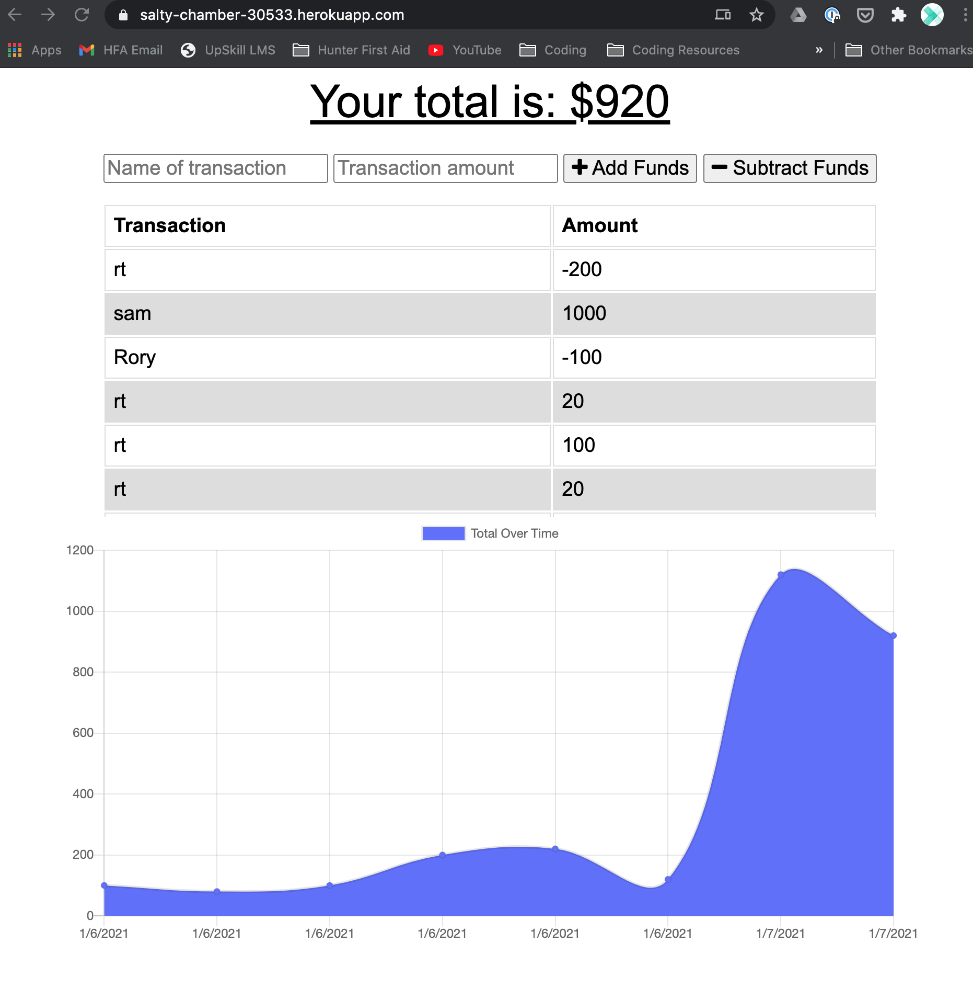

# budgettracker

## Description

budgettracker is an app that tracks income and expenses with a simple number value and label to that transaction. The app works both on and offline with the user minimally interupted with losses of connection.

**## User Story**

AS AN avid traveller

I WANT to be able to track my withdrawals and deposits with or without a data/internet connection

SO THAT my account balance is accurate when I am traveling.

# Screenshots

# Technologies 

 - Javascript 
 - Node js
 - Webpack
 - Service Worker

 # Installation - (for developers)

 - Requires node js
 - NPM install
 - npm start

 # Deployed links 

 Github: https://github.com/rorydavidtanner/budgettracker

 Heroku App: https://salty-chamber-30533.herokuapp.com/ 